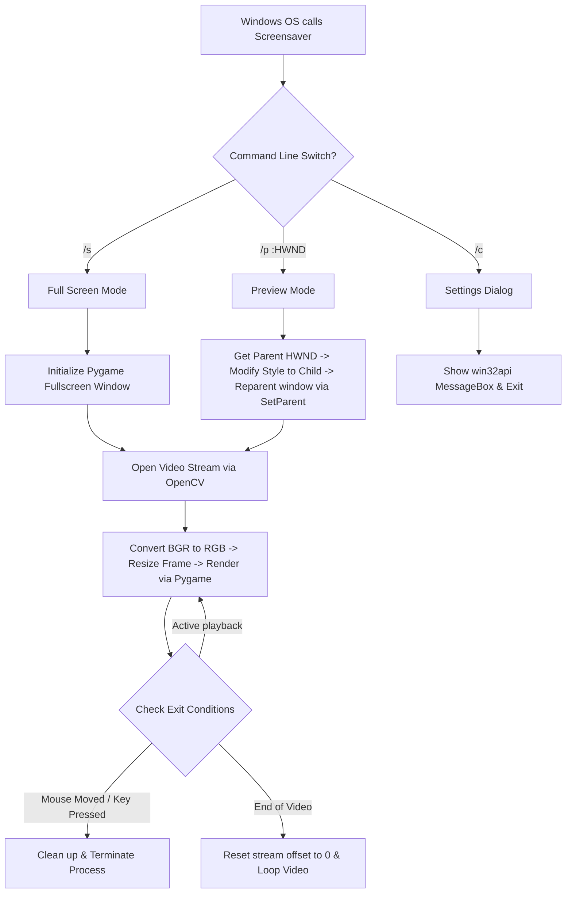

# 🏴‍☠️ Luffy Live Wallpaper & Screensaver

# Welcome to the **Luffy Live Wallpaper & Screensaver** project! This repository contains a production-grade, Python-based desktop customization suite for Windows. It provides two fully autonomous components:

1. **Interactive Screensaver (`.scr`)**: A full-screen video player built using OpenCV and Pygame that handles the native Windows screensaver lifecycle (preview mode, full-screen playback, and settings dialogue).
2. **Live Wallpaper Engine**: A background daemon that injects an MP4 video stream directly behind desktop icons by interacting with low-level Windows APIs (`user32.dll` and `kernel32.dll` via `win32gui`).

---

## 📋 Table of Contents
1. [🚀 Step-by-Step Laptop Setup Guide](#-step-by-step-laptop-setup-guide)
2. [🛠️ Making & Compiling: Build Architecture](#%EF%B8%8F-making--compiling-build-architecture)
3. [⚙️ How it Works (Under the Hood)](#%EF%B8%8F-how-it-works-under-the-hood)
4. [💻 Installing & Deploying on Your Laptop](#-installing--deploying-on-your-laptop)
5. [⚠️ Troubleshooting & Common Errors Explained](#%EF%B8%8F-troubleshooting--common-errors-explained)

---

## 🚀 Step-by-Step Laptop Setup Guide

To run or build these applications, set up the runtime environment on your Windows laptop as follows:

### Step 1: Install Python
Download and install Python (v3.8 or newer) from [python.org](https://www.python.org/downloads/).
> [!IMPORTANT]
> During installation, you **MUST check "Add Python to PATH"**. If missed, terminal commands like `pip` or `python` will not work.

### Step 2: Open Terminal / Command Prompt
1. Open the folder containing this project in File Explorer.
2. Click on the address bar at the top, type `cmd` or `powershell`, and press **Enter**.

### Step 3: Install Required Libraries
Run this command in the terminal window to fetch all necessary third-party Python packages:
```bash
pip install opencv-python pygame pywin32 pyinstaller
```

---

## 🛠️ Making & Compiling: Build Architecture

Windows screensavers are standard PE (Portable Executable) binary files (like `.exe`) renamed to `.scr`. To package the scripts so they run on any laptop without requiring Python to be installed, we compile them using **PyInstaller**.

### The Spec File (`LuffyScreensaver.spec`) Explained
PyInstaller reads a `.spec` (Specification) script to configure the build:
* **`Analysis`**: Tells the compiler which script is the entry point (`screensaver.py`) and defines data assets to bundle. The directive `datas=[('One-Piece-ScreenSaver.mp4', '.')]` bundles the video asset directly inside the compiled binary.
* **`EXE`**: Packages the runtime into a single, standalone executable (`console=False` hides the black command prompt window; `upx=True` compresses the binary size).

### Build Instructions

#### Method A: Compiling via Spec File (Recommended)
Run the following command in your terminal:
```bash
pyinstaller --clean LuffyScreensaver.spec
```

#### Method B: Manual CLI Compilation
If you do not want to use the spec file, compile using this raw CLI command:
```bash
pyinstaller --onefile --noconsole --name LuffyScreensaver --add-data "One-Piece-ScreenSaver.mp4;." screensaver.py
```
> [!WARNING]
> On Windows, the `--add-data` option uses a **semicolon (`;`)** to separate the source file from the destination directory. Using a colon (`:`) will cause PyInstaller to crash.

#### Post-Compilation Steps:
1. Locate `LuffyScreensaver.exe` inside the newly generated `dist/` directory.
2. Rename the file extension from `.exe` to `.scr` (e.g. `LuffyScreensaver.scr`).
3. Move `LuffyScreensaver.scr` back to your main project folder.

---

## ⚙️ How it Works (Under the Hood)

### 1. Screensaver Architecture (`screensaver.py`)
Windows coordinates screensaver actions using specific command-line switches passed to the executable:

| Switch / Argument | Mode | Description |
| :--- | :--- | :--- |
| `/s` | **Run Mode** | Launches the screensaver in full screen. |
| `/p <HWND>` | **Preview Mode** | Embeds a small thumbnail inside the Windows Screensaver Settings panel. |
| `/c` or `/c:<HWND>` | **Settings Mode** | Displays configuration dialogue / properties box. |

#### Under-the-hood Execution Flow:


#### Low-Level Technical Details:
* **DPI Awareness**: The script calls `ctypes.windll.shcore.SetProcessDpiAwareness(2)` on startup. This prevents Windows from forcibly scaling the screensaver window on high-DPI displays, which would otherwise result in blurry video rendering.
* **Preview reparenting**: In preview mode, Pygame opens a regular frameless window. The script uses `win32gui.SetParent(pygame_hwnd, parent_hwnd)` to attach the Pygame window directly inside the small preview area, converting its style flags to `WS_CHILD`.
* **Motion Threshold**: To prevent accidental exits from minor vibrations, coordinate polling compares current mouse coordinates to the initial coordinates and requires a delta greater than `20px` to exit.

---

### 2. Live Wallpaper Architecture (`live_wallpaper.py`)
Windows draws the desktop using a window manager hierarchy. By default, the wallpaper is handled by `Progman` (Program Manager). The live wallpaper engine bypasses this by forcing the shell to spawn a window behind desktop icons.

#### Desktop Window Tree Hijacking:
Normally, the window tree looks like this:
```
[Desktop Root]
  └── Progman (Desktop Icons and background)
```

By sending an undocumented message `0x052C` to the `Progman` window, Windows splits the desktop into two layers, spawning a `WorkerW` window right behind the icon layer:
```
[Desktop Root]
  ├── Progman
  │     └── SHELLDLL_DefView (Contains desktop icons)
  └── WorkerW (Window positioned behind icons)  <-- Target Injection Point
```

Our script finds this target `WorkerW` window handle, creates a borderless Pygame window playing the looped video, and reparents it directly inside `WorkerW` using:
```python
win32gui.SetParent(pygame_hwnd, workerw_target)
```
As a result, the video plays continuously on the desktop surface while your shortcuts and icons render cleanly on top!

#### Self-Healing Features:
* **Resolution Change Monitor**: The daemon checks system metrics periodically. If you change monitor resolution or plug in an external display, the Pygame window automatically recalculates aspect ratios and resizes itself.
* **Window Restructuring**: If the Windows shell crashes or restarts (e.g. `explorer.exe` restarting), the script detects that the target `WorkerW` has been destroyed, automatically issues another `0x052C` call, searches for the new handle, and re-injects the video.

---

## 💻 Installing & Deploying on Your Laptop

### 1. Activating the Screensaver
#### Method 1: Automatic installer (PowerShell)
Right-click on `install.ps1` and select **Run with PowerShell**. This will update registry parameters in `HKCU:\Control Panel\Desktop` immediately.

#### Method 2: Manual deployment
1. Right-click on your compiled `LuffyScreensaver.scr` and select **Install**.
2. Alternatively, copy `LuffyScreensaver.scr` directly to the Windows system folder: `C:\Windows\System32`. It will then appear in your native Windows screensaver drop-down list.

### 2. Starting/Stopping the Live Wallpaper
* **To start**: Double-click `start_wallpaper.bat`. It will create an autostart shortcut in your Windows Startup directory (`APPDATA\Microsoft\Windows\Start Menu\Programs\Startup`) and run the daemon in the background.
* **To stop**: Double-click `stop_wallpaper.bat`. This reads the PID stored in `wallpaper.pid` and terminates the process.

---

## ⚠️ Troubleshooting & Common Errors Explained

### Error 1: `pywintypes.error: (1400, 'SetParent', 'Invalid window handle.')`
* **Why it happens**: When Windows displays a preview thumbnail, it quickly starts and stops screensaver instances as you navigate the settings interface. If the settings window is closed or updated while Pygame is still initializing, the parent `HWND` passed to `/p` disappears, making the `SetParent` call fail.
* **Solution**: This is a normal lifecycle behavior. The code catches this error within a `try/except` block and shuts down cleanly. No action is required.

### Error 2: `FileNotFoundError` or Video Black Screen
* **Why it happens**: When running inside PyInstaller (frozen mode), files are extracted to a dynamic directory (`sys._MEIPASS`). If path lookup is static, the video player cannot locate the MP4 file.
* **Solution**: The script resolves this by verifying the runtime state:
  ```python
  if getattr(sys, 'frozen', False):
      base_path = sys._MEIPASS
  ```
  Ensure `One-Piece-ScreenSaver.mp4` is present inside the folder *before* running compiling commands.

### Error 3: Screensaver exits instantly on startup
* **Why it happens**: Optical mouse sensors or touchpads can report microscopic movements (mouse drift) during initial window focus.
* **Solution**: Keep your hands off the trackpad/mouse once the computer transitions to idle. The script includes a **2.0-second delay** and a **20-pixel threshold** to suppress these micro-movements.

### Error 4: PowerShell Execution Policy Restriction
* **Why it happens**: Windows prevents arbitrary script execution by default.
* **Solution**: Run PowerShell as Administrator and run:
  ```powershell
  Set-ExecutionPolicy -ExecutionPolicy RemoteSigned -Scope CurrentUser
  ```

### Error 5: Python/Pythonw is not recognized
* **Why it happens**: Python was installed without checking the "Add to PATH" option.
* **Solution**: Run the Python installer again, select **Modify**, check the **"Add Python to environment variables"** box, and finish the installation.
